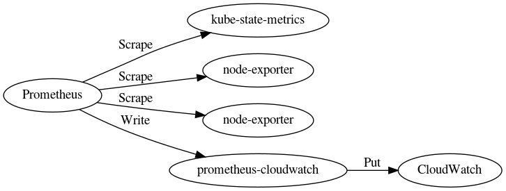

Prometheus: CloudWatch [](https://circleci.com/gh/skpr/prometheus-cloudwatch)
======================

Prometheus remote writer for CloudWatch.



## Usage

**Run prometheus-cloudwatch**

```bash
$ ./prometheus-cloudwatch 
INFO[0000] Starting writer server: :8080                 source="main.go:131"
INFO[0000] Starting metrics servere: :9000               source="main.go:152"
```

**Configure Prometheus**

```yaml
remote_write:
  - url: http://127.0.0.1:8080/write
```
